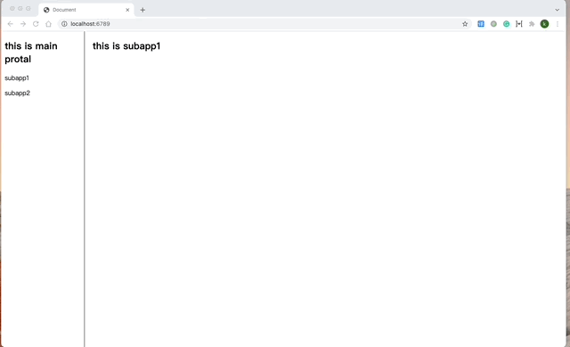

## webpack 模块联邦

模块联邦( Module Federation ) 是 webpack5 的一个新特性，它可以使程序像搭积木一样，分成多个模块共同开发，可以作为一种前端微服务的解决方案。

### 概念
模块联邦是 webpack 的一个插件，使用非常简单，只需要在 webpack 的 plugins 下添加即可：
```js
const { ModuleFederationPlugin } = require("webpack").container;

...
plugins: [
    new ModuleFederationPlugin({
      name: "module_federation_lib", // 名字必须唯一，不能用中划线 '-' 分隔
      filename: "remoteEntry.js", // 入口文件
      exposes: {  // 暴露出去的路径及依赖
        "./react": "react",
        "./react-dom": "react-dom",
      },
    }),
  ],
...

```

例如上述代码，定义一个`module_federation_lib`库，向外暴露 react 和 react-dom 两个库，入口文件是 remoteEntry.js ，使用的时候同样在 webpack 下的 plugins 添加如下代码：
```js
new ModuleFederationPlugin({
      name: "subapp1", // 名字必须唯一，不能用中划线 '-' 分隔
      filename: "remoteEntry.js",// 入口文件
      exposes: {  // 暴露出去的路径及依赖
        "./index": "./app.js",
      },
      remotes: { // 引用的模块
        "module-federation-lib":
          "module_federation_lib@http://localhost:6780/remoteEntry.js", // 指定远程 module_federation_lib 路径
      },
    }),
```

就可以在代码中使用：
```js
import React, { Component }  from "module-federation-lib/react";
```

> 注意：一个常规的 import 是同步的，并不会等待模块下载。这里将所有的异步 remote module 的加载处理成了异步语义(就像 import() )(注：但是需要一个异步加载的边界，)。 此时，就可以在加载本 chunk 的其他普通模块的同时，通过容器并行加载 remote module 。


>注意：异步加载边界不好理解，可以用 webpack 文档中 Module Federation 介绍中的一句话来说明：加载 remote module ，必须在任意一个异步 chunk 加载之后执行。所以官方 webpack repo 中给出的例子，直接在入口处添加一个 import('boostrap') 即可，也可以查看项目下的代码示例。

### demo

本项目分为四个项目：

1. module-federation-lib 存放模块库
2. module-federation-main 存放主应用框架 protal
3. module-federation-subapp1 和 module-federation-subapp2 ，子应用 1 和子应用 2 

分别进入项目安装依赖，然后分别启动即可。

### 效果

使用模块联邦后的 demo 如下图所示:




具体配置可查看相关代码.

### 设想

模块联邦提供了一种全新的机制，一方面可以隔离应用，另一方面可以复用应用之间的公共依赖，适合大项目的微服务化，而且还有提升项目打包速度，优化项目体积等作用。

根据其官方文档，甚至可以通过修改 url 传参来响应不同的子应用版本，如下：

```js
 plugins: [
    new ModuleFederationPlugin({
      name: 'host',
      remotes: {
        app1: `promise new Promise(resolve => {
      const urlParams = new URLSearchParams(window.location.search)
      const version = urlParams.get('app1VersionParam')
      // This part depends on how you plan on hosting and versioning your federated modules
      const remoteUrlWithVersion = 'http://localhost:3001/' + version + '/remoteEntry.js'
      const script = document.createElement('script')
      script.src = remoteUrlWithVersion
      script.onload = () => {
        // the injected script has loaded and is available on window
        // we can now resolve this Promise
        const proxy = {
          get: (request) => window.app1.get(request),
          init: (arg) => {
            try {
              return window.app1.init(arg)
            } catch(e) {
              console.log('remote container already initialized')
            }
          }
        }
        resolve(proxy)
      }
      // inject this script with the src set to the versioned remoteEntry.js
      document.head.appendChild(script);
    })
    `,
      },
      // ...
    }),
  ],
```

这可能是目前最好的微服务方案了。

参考文档: 
1. [https://webpack.js.org/concepts/module-federation/](https://webpack.js.org/concepts/module-federation/)
2. [https://webpack.docschina.org/plugins/module-federation-plugin/](https://webpack.docschina.org/plugins/module-federation-plugin/)